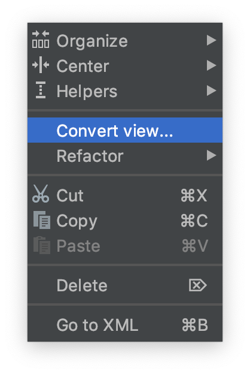
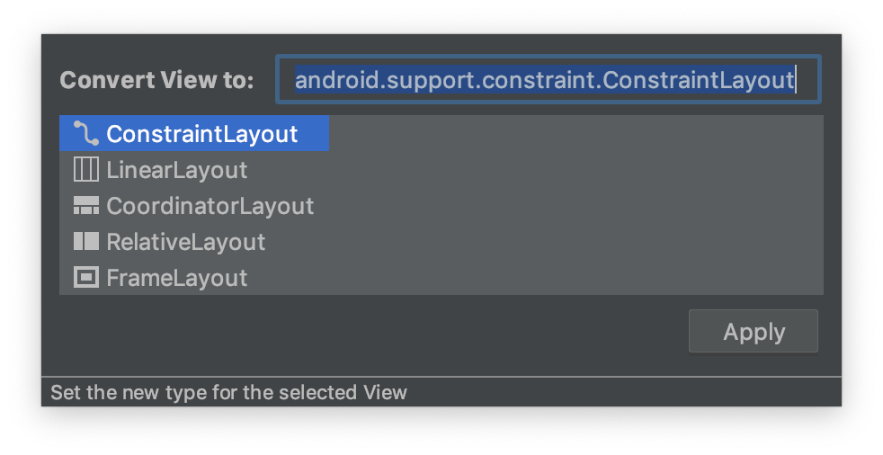
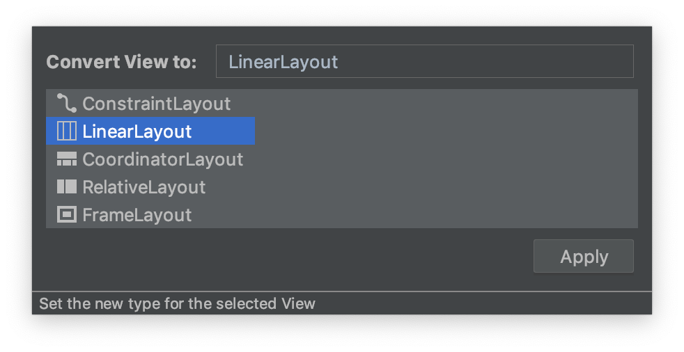
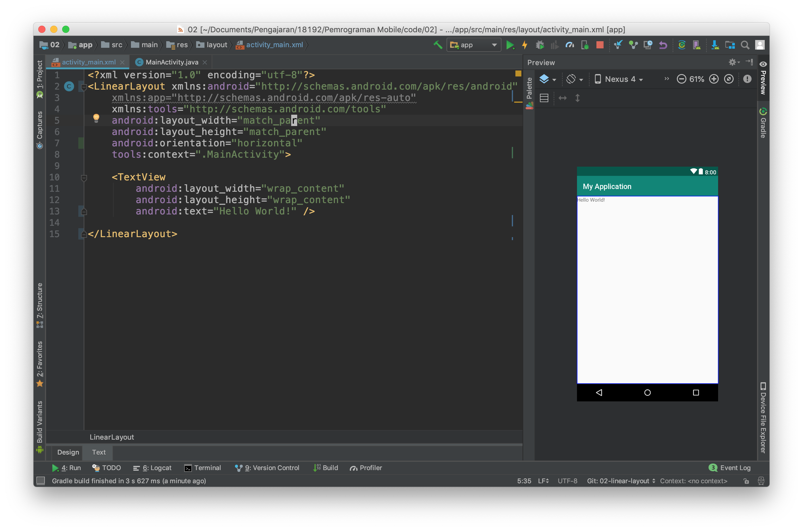
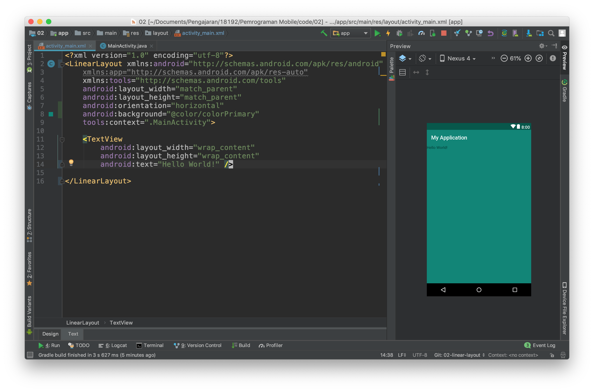
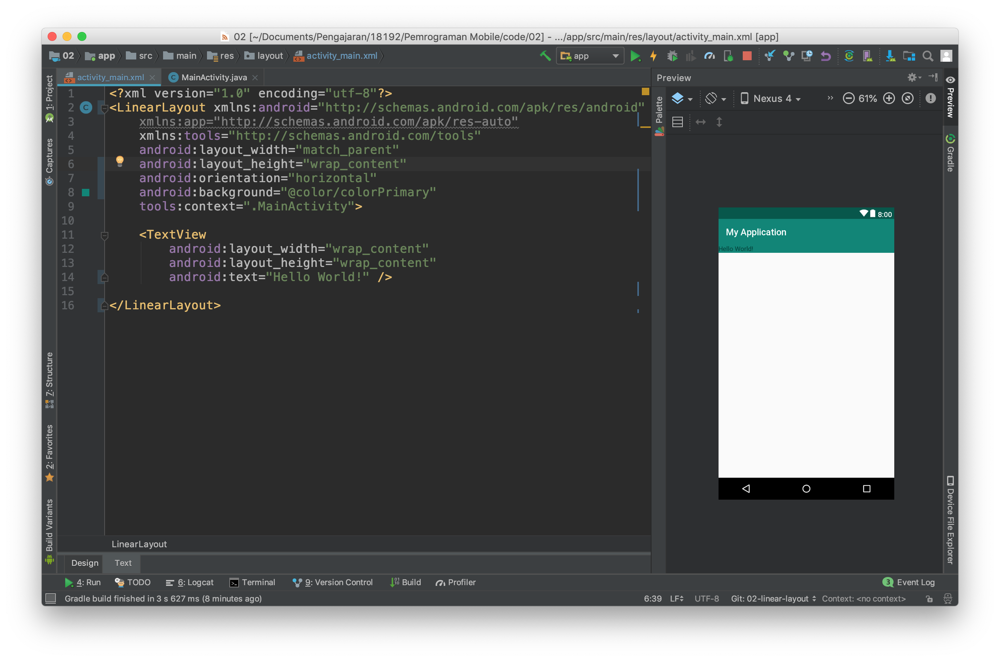
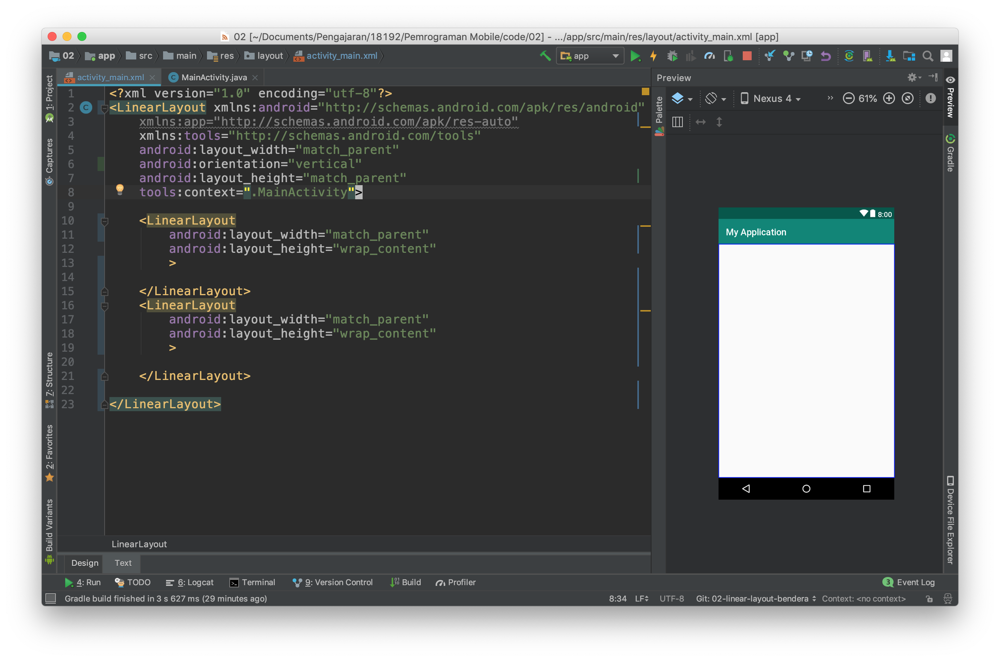

# Membuat aplikasi dengan linear layout
- Buatlah kembali sebuah project baru dengan konfigurasi yang disesuaikan dengan kebutuhan anda seperti pada langkah praktikum sebelumnya.
- Bukalah file `activity_main.xml` kemudian buka dengan menggunakan design mode.

- Kemudian lakukan konversi view dari constraint layout ke lineear layout.

- Kemudian gantilah design mode ke text mode. 

- Tambahkan properties `android:orientation="vertical"` pada tag `LinearLayout`

Anda baru saja menambahkan atrribut baru pada tag xml, ada banyak properties lain yang perlu anda ketahui silahkan melakukan explorasi untuk properties atribut lain.

- Selanjutnya tambahkan properties background pada linear layout seperti pada gambar dibawah ini sehingga layout anda berubah background nya menjadi hijau.

- Kemudian ubahlah nilai dari properties `layout_height` menjadi wrap_content

- Lakukanlah kompilasi kemudian simpulkan apakah perbedaan antara `wrap_content` dan `match_parent`

Selain properties diatas linear layout mempunyai properties khusus yang hanya ada pada tipe layout ini, yaitu `weigth_sum` dan `layout_weight`

- weight_sum adalah bobot yang diberikan kepada LinearLayout bobot ini nantinya dapat digunakan untuk membagi ukuran yang dapat dimiliki oleh child dari LinearLayout.
- layout_weight adalah bobot yang diberikan kepada child dari LinearLayout untuk menentukan ukuran dari child ini pada layar.

Untuk memahami penggunaannya lakukan langkah percobaaan berikut ini :

- Buka kembali project sebelumnya, kemudian kembalikan `layout_height` ke `match_parent`, juga hapus properties background seperti pada gambar dibawah ini :

- Hapuslah tag xml TextView kemudian isilah LinearLayout dengan dua buah child lain yang juga sebuah LinearLayout hasilnya seperti pada gambar dibawah ini.

- Jika anda lihat belum terjadi perubahan apapun pada layout, untuk itu lanjutkan dengan menambahkan properties background, weight_sum dan layout_weight seperti pada gambar dibawah ini.

> kita dapat menggunakan LinearLayout sebagai child dari LinearLayout atau layout lain proses ini dinamakan nested layout

- Berdasarkan percobaan diatas lakukan lah perubahan perubahan sebagai berikut kemudian ambil lah kesimpulan dari percobaan ini.
  - ubah orientasi menjadi horizontal
  - ubah weight sum menjadi angka integer yang lain
  - ubah layout_weight dari salah satu LinearLayout