# RecyclerView Sangat Sederhana

Pada Praktikum kali ini kita akan membuat sebuah recyclerview yang sangat sederhana dimana pada recyclerview ini hanya terdapat sebuah item text view.

## Hasil Yang Diharapkan

## New Project

Buatlah sebuah project baru sesuaikan konfigurasi project ini dengan environtment SDK pada Android Studio anda, contoh konfigurasinya :


## Dependency

Dependency yang digunakan pada project ini adalah dependency untuk recyclerview, namun karena ada perbedaan pada versi android sdk yang digunakan berikut ini disediakan beberapa konfigurasi `build.gradle` pada module `app` yang digunakan.

Untuk sdk 29 sudah menggunakan `androidx`

```gradle
implementation 'androidx.recyclerview:recyclerview:1.1.0'
```

Untuk sdk dibawah 29 menggunakan support library. Contoh untuk sdk 28 menggunakan versi recyclerview dibawah ini

```gradle
implementation 'com.android.support:recyclerview-v7:28.0.0'
```

Perhatikan target sdk version yang anda gunakan pada file `build.gradle` untuk module `app` dan isikan recyclerview yang sesuai dengan kebutuhan anda.

Contoh dependency :

```gradle

dependencies {
    implementation fileTree(dir: 'libs', include: ['*.jar'])
    implementation 'androidx.appcompat:appcompat:1.0.2'
    implementation 'androidx.constraintlayout:constraintlayout:1.1.3'
    implementation 'androidx.recyclerview:recyclerview:1.0.0'
    testImplementation 'junit:junit:4.12'
    androidTestImplementation 'androidx.test:runner:1.2.0'
    androidTestImplementation 'androidx.test.espresso:espresso-core:3.2.0'
}
```

## Model

Berdasarkan hasil yang diharapkan dapat dilihat bahwa pada recyclerview yang dihasilkan hanya memiliki satu data yaitu sebuah text oleh karena itu model di desain sesuai dengan kebutuhan pada hasil akhir. Lakukanlah langkah langkah berikut ini untuk membuat file model pada project ini.

### Buat Package Models

Agar file file yang ada pada project tersusun rapi buatlah sebuah package dengan nama `models` sebagai tempat untuk menyimpan file models.

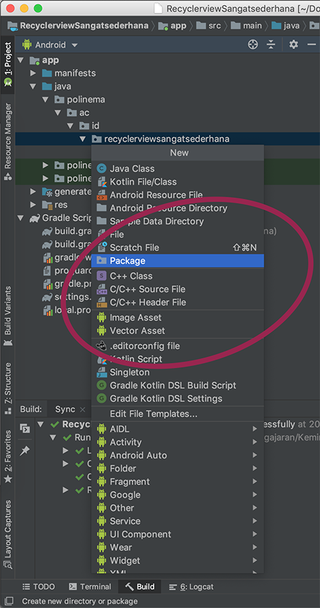

Beri nama package `models`

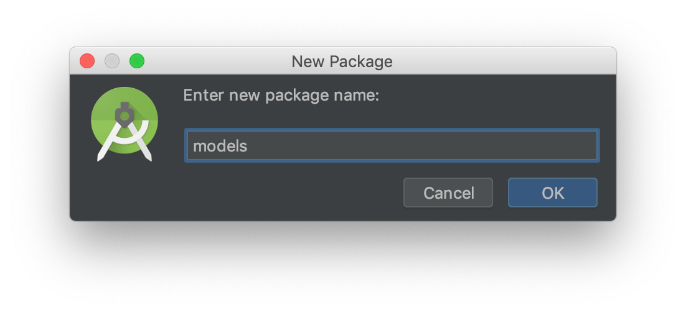

### Buat Class Models

Buatlah sebuah file baru pada package models beri nama file tersebut `SuperHero` dan beri tipe `class`


### Isi Class Models

Isilah class SuperHero dengan sebuah attribut public bernama `heroName` dan lengkapi dengan construktor serta `setter dan getter`

```java
package polinema.ac.id.recyclerviewsangatsederhana.models;

public class SuperHero {
    public String heroName;

    public SuperHero(String heroName) {
        this.heroName = heroName;
    }

    public String getHeroName() {
        return heroName;
    }

    public void setHeroName(String heroName) {
        this.heroName = heroName;
    }
}
```

## Item Layout

Layout pada recyclerview ini berupa sebuah layout xml sederhana silahkan anda memilih layout mana saja asalkan dapat menampilkan sebuah textview. Berikut ini contoh langkah langkah untuk membuat item layout.


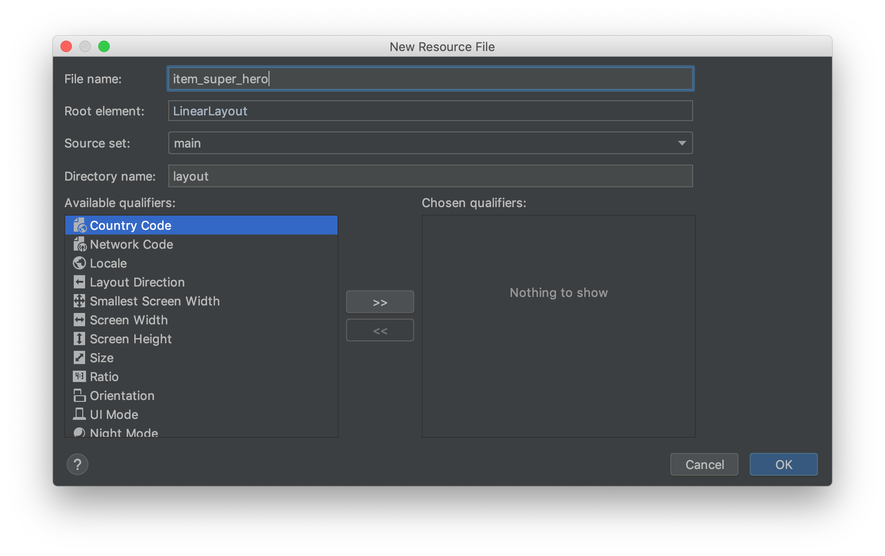

Contoh kode program `item_super_hero.xml`

```xml
<?xml version="1.0" encoding="utf-8"?>
<LinearLayout xmlns:android="http://schemas.android.com/apk/res/android"
    android:orientation="vertical" android:layout_width="match_parent"
    android:layout_height="50dp">
    <TextView
        android:gravity="center"
        android:id="@+id/heroName"
        android:layout_width="match_parent"
        android:layout_height="wrap_content"
        android:text="Hero Name"
        android:textSize="20sp"
        />
</LinearLayout>
```

## Recycler Layout

Bukalah file `activity_main.xml` kemudian hapus `textview` `hello world` nya

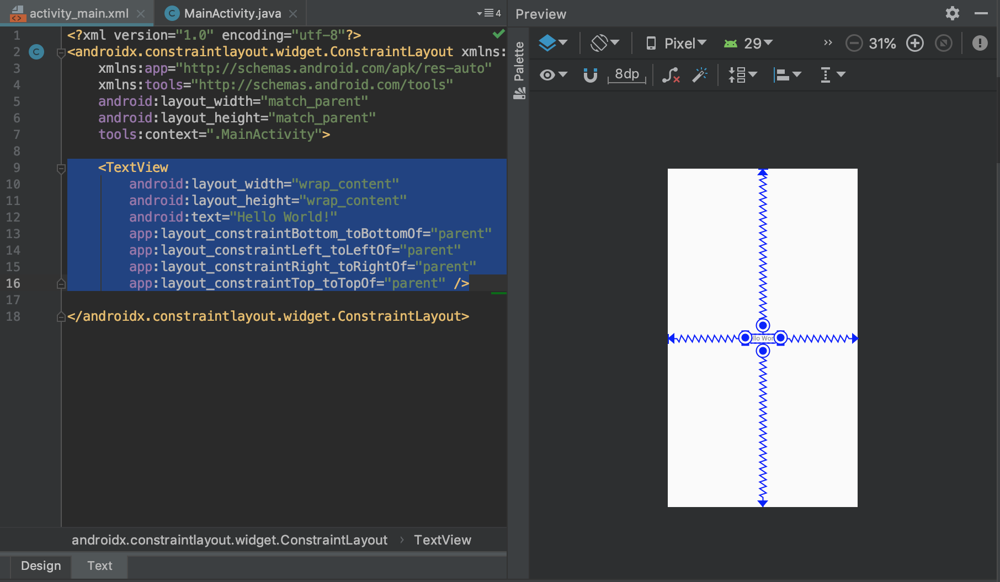

Kemudian isikan sebuah recyclerview dan setting constraint nya untuk memenuhi seluruh layar

```xml
<?xml version="1.0" encoding="utf-8"?>
<androidx.constraintlayout.widget.ConstraintLayout xmlns:android="http://schemas.android.com/apk/res/android"
    xmlns:app="http://schemas.android.com/apk/res-auto"
    xmlns:tools="http://schemas.android.com/tools"
    android:layout_width="match_parent"
    android:layout_height="match_parent"
    tools:context=".MainActivity">


    <androidx.recyclerview.widget.RecyclerView
        app:layout_constraintLeft_toLeftOf="parent"
        app:layout_constraintRight_toRightOf="parent"
        app:layout_constraintTop_toTopOf="parent"
        app:layout_constraintBottom_toBottomOf="parent"
        android:layout_width="match_parent"
        android:layout_height="match_parent"
        tools:layout_editor_absoluteX="8dp"
        tools:layout_editor_absoluteY="8dp" />

</androidx.constraintlayout.widget.ConstraintLayout>
```

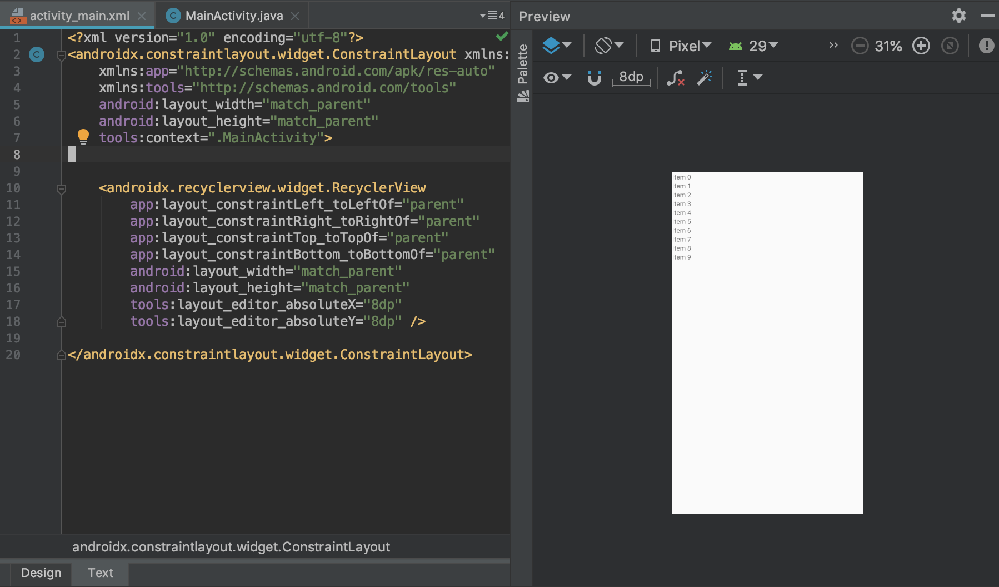

## Adapter

Adapter adalah bagian terpenting dari sebuah `recyclerview` oleh karena itu perhatikanlah langkah langkah pembuatan `Adapter` berikut ini dengan seksama.

### Buat Package Adapter

Buatlah package `adapters` pada project dengan langkah berikut ini :


### Buat Class Adapter

Buatlah sebuah class pada package `adapters` berilah nama SuperHeroAdapter
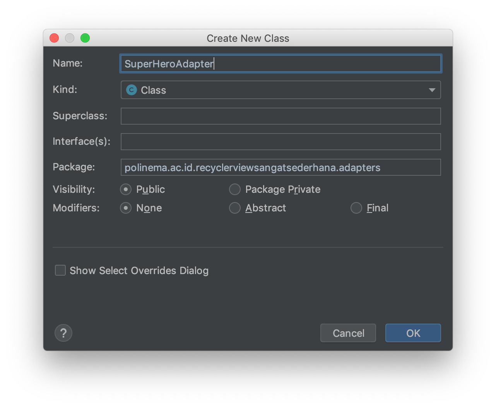

Kode program hasil pembuatan class `SuperHeroAdapter`

```java
package polinema.ac.id.recyclerviewsangatsederhana.adapters;

public class SuperHeroAdapter {
}

```

### Extends

Sebuah adapter harus melakukan extend ke class RecyclerView.Adapter<VH>, perhatikan gambar dibawah ini untuk melihat langkah pembuatan extend nya.

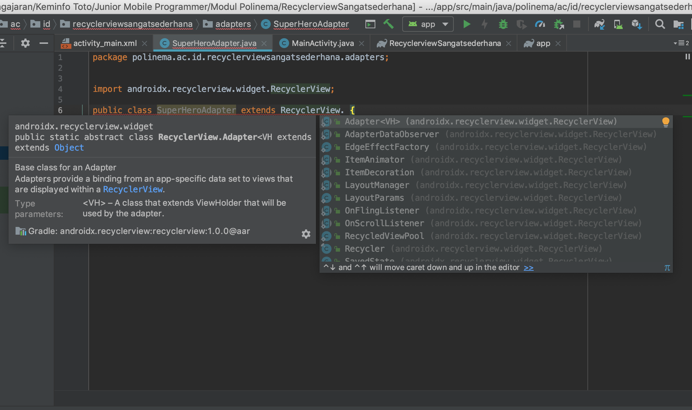


Pada langkah ini akan terjadi error yang akan kita perbaiki pada tahap selanjutnya

### Implement Methods

Pindahkan cursor pada awal class `RecyclerView` kemudian pilih `alt+insert` untuk windows atau `alt + enter` untuk mac os kemudian pilih `Implements Methods`.


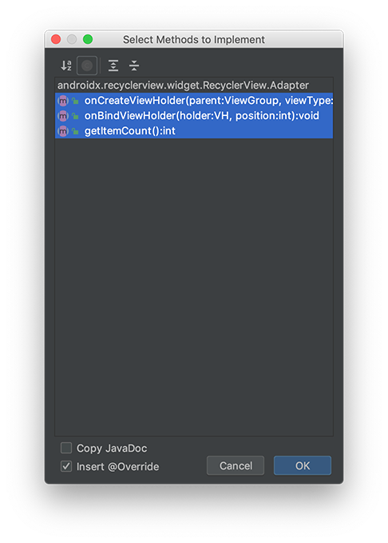

Pilih semua method dan hasilnya ada seperti berikut ini :

```java
package polinema.ac.id.recyclerviewsangatsederhana.adapters;


import android.view.ViewGroup;

import androidx.annotation.NonNull;
import androidx.recyclerview.widget.RecyclerView;

public class SuperHeroAdapter extends RecyclerView.Adapter<SuperHeroAdapter.MyViewHolder> {
    @NonNull
    @Override
    public SuperHeroAdapter.MyViewHolder onCreateViewHolder(@NonNull ViewGroup parent, int viewType) {
        return null;
    }

    @Override
    public void onBindViewHolder(@NonNull SuperHeroAdapter.MyViewHolder holder, int position) {

    }

    @Override
    public int getItemCount() {
        return 0;
    }
}

```

### Inner Class

Sampai pada saat ini class yang anda buat masih error, lanjutkan dengan memindahkan cursor ke `MyViewHolder` kemudian tekan kembali `alt+insert` atau `alt+enter` kemudian pilih `create class`


Hasil dari perintah diatas seperti gambar dibawah ini


Class nya masih error arahkan cursor ke `SuperHeroAdapter.MyViewHolder` kemudian pilih opsi `Make MyViewHolder extends ...`

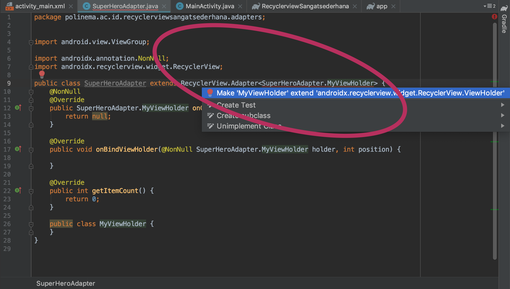

Berikut ini hasilnya, namun masih ada error untuk memperbaiki error lanjutkan ke langkah selanjutnya
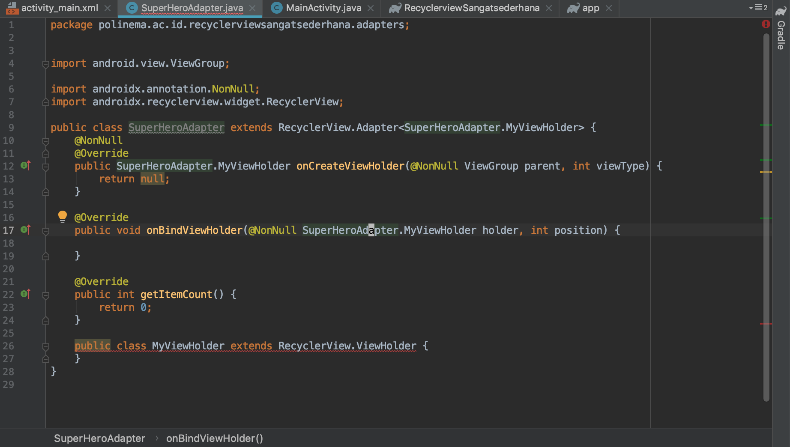

Pindahkan kursor ke kode program yang masih merah kemudian tekan kembali `alt+enter` atau `alt+insert` kemudian pilih opsi `create constructor matching super`

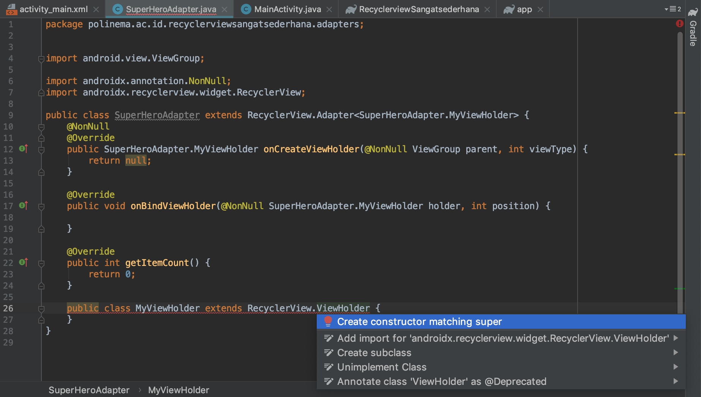

### Variabel Data

Berikan variabel untuk menampung data dari activity, karena adapter membutuhkan data data ini diambil dari activity oleh karena itu buatlah sebuah variabel berupa list of `SuperHero` dengan nama `heroList`


Setelah itu buatkan constructor untuk class ini dengan menekan shortcut `alt + insert` pada windows atau `cmd+n` pada mac.

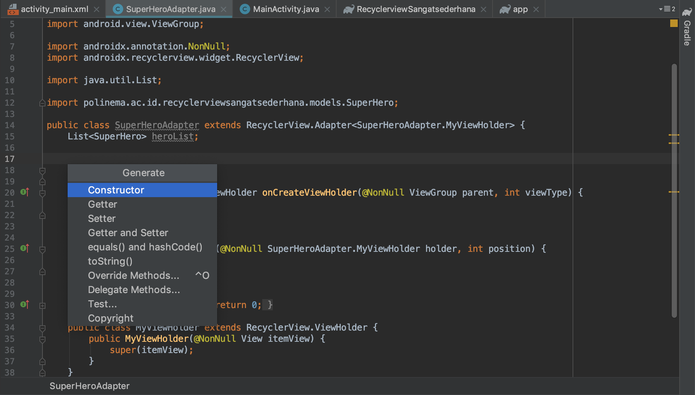

Pilih variabel `heroList`
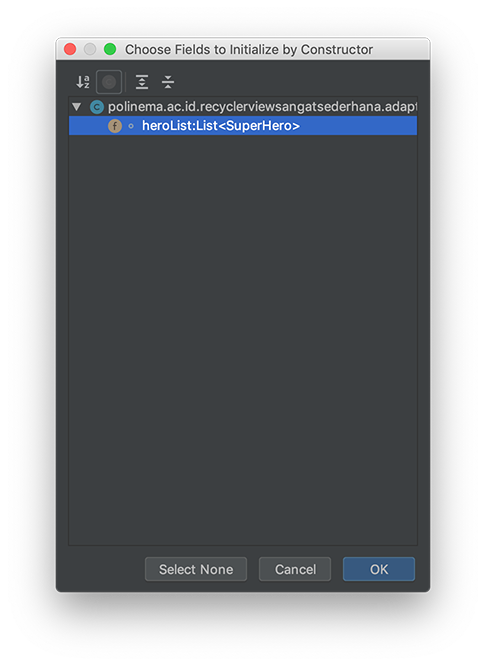

Berikut ini hasil dari proses pembuatan Adapter (masih separoh jalan :) )

```java
package polinema.ac.id.recyclerviewsangatsederhana.adapters;


import android.view.View;
import android.view.ViewGroup;

import androidx.annotation.NonNull;
import androidx.recyclerview.widget.RecyclerView;

import java.util.List;

import polinema.ac.id.recyclerviewsangatsederhana.models.SuperHero;

public class SuperHeroAdapter extends RecyclerView.Adapter<SuperHeroAdapter.MyViewHolder> {
    List<SuperHero> heroList;

    public SuperHeroAdapter(List<SuperHero> heroList) {
        this.heroList = heroList;
    }

    @NonNull
    @Override
    public SuperHeroAdapter.MyViewHolder onCreateViewHolder(@NonNull ViewGroup parent, int viewType) {
        return null;
    }

    @Override
    public void onBindViewHolder(@NonNull SuperHeroAdapter.MyViewHolder holder, int position) {

    }

    @Override
    public int getItemCount() {
        return 0;
    }

    public class MyViewHolder extends RecyclerView.ViewHolder {
        public MyViewHolder(@NonNull View itemView) {
            super(itemView);
        }
    }
}

```

Langkah selanjutnya adalah mengisi dan memahami fungsi dari masing masing function dan inner class yang ada pada adapter

### Urutan Mengisi Function Pada Adapter

#### Get Item Count

Function yang paling mudah untuk di isi pada adapter ini adalah function `getItemCount()` function ini berfungsi mengembalikan jumlah data yang ingin ditampilkan pada `RecyclerView`, Tambahkan `heroList.size()` pada function `getItemCount()`

```java
public class SuperHeroAdapter extends RecyclerView.Adapter<SuperHeroAdapter.MyViewHolder> {
...
    @Override
    public int getItemCount()    {
        return heroList.size();
    }

    public class MyViewHolder extends RecyclerView.ViewHolder {
        public MyViewHolder(@NonNull View itemView) {
            super(itemView);
        }
    }
}

```

#### OnCreateViewHolder

Function ini berfungsi seperti `onCreate` pada activity dimana pada function ini juga dilakukan pendefenisian layout mana yang digunakan pada saat recyclerview dibuat. Jadi item layout yang dibuat sebelumnya di koneksikan di fungsi ini.

## Instansiasi RecyclerView

## Instansiasi Model

## Instansiasi Adapter

## Set Adapter dan Layout Manager
