# Praktikum  1: Aplikasi BMI Sederhana
Aplikasi yang hendak dibuat pada kegiatan kali ini adalah aplikasi penghitung indeks bobot tubuh atau dikenal dengan istilah *body mass index* (BMI).

Secara ringkas, urutan perjalanan aplikasi yang dibuat berawal dari kemunculan sebuah *splash screen* dan dilanjutkan dengan antarmuka utama yaitu kalkulator BMI dengan aturan pengguna harus memasukkan beberapa data antara lain:
1. Jenis kelamin (*Radio Group*), 
2. Berat badan (*Edit Text*),
3. Tinggi badan (*Edit Text*), dan
4. Umur (*Edit Text*).

Hasil ditampilkan melalui *dialog box* berisi informasi dari masukan yang telah diberikan oleh pengguna.

Pada bagian ini, template yang digunakan adalah template asli yang disediakan oleh Android Studio.

## Pembuatan project 
1. Buka aplikasi Android Studio, pilih `Start a new Android Studio Project`. 
2. Jenis project yang dipilih adalah `empty activity`.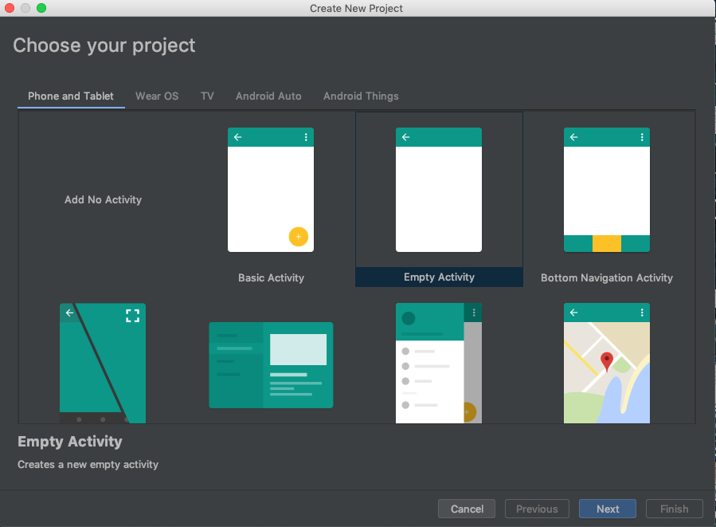
3. Beri nama project (contoh: Aplikasi Kalkulator BMI) dan nama packagenya (contoh: polinema.ac.id.aplikasikalkulatorbmi) yang sesuai.
4. Project awal selesai dibuat.
## Penataan Layout
Layout yang dibuat meliputi beberapa komponen yaitu `RadioGroup`, `TextView`, `EditText`, dan `Button`. Layout yang akan dibuat akan berbentuk seperti berikut.

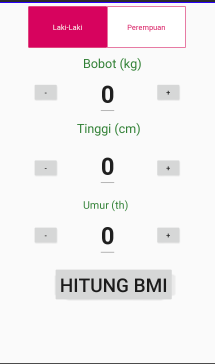
1. Buka **activity_main.xml** yang terletak di **app -> res -> layout -> activity_main.xml**. 
   
2. Buat layout dengan jenis `Constraint Layout`. tambahkan id dengan nama `activity_main`.
   
3. Tambahkan sebuah komponen `radio group`. Perhatikan bahwa constraint yang berlaku pada komponen radio grup ini antara lain:
`app:layout_constraintEnd_toEndOf="parent"`,
`app:layout_constraintStart_toStartOf="parent"`, dan
`app:layout_constraintTop_toTopOf="parent"`.

4. Item-item pada `radio group` diwujudkan sebagai `radio button`, tambahkan properti-properti berikut di `radio button`,abaikan sementara tanda merah di kode program.
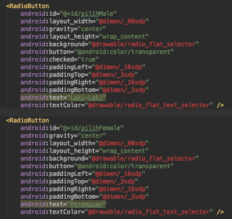
5. Tambahkan tiga buah TextView, berikan nama masing-masing **Bobot(kg)**, **Tinggi(cm)**, **Umur(th)**.
   
   
6. Tambahkan dua buah `Button` dan sebuah `EditText` dengan posisi setelah `TextView` yang telah dibuat. Perhatikan bahwa `Button` dan `EditText` memiliki id yang berbeda.

    a. `Button` dan `EditText` pada bobot.
    
    

    b. `Button` dan `EditText` pada tinggi.
    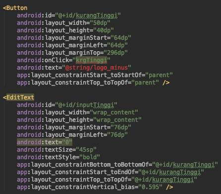
    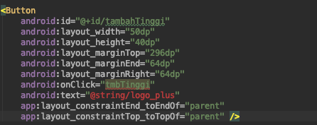

    c. `Button` dan `EditText` pada umur.
    
    
7. Tambahkan sebuah `Button` di bagian layout paling bawah untuk tombol proses hitung BMI.
    
8. Tanda merah yang terdapat di kode program diatasi dengan memperhatikan posisi `value` yang seharusnya diletakkan, seperti **@string/** berarti terletak di **app -> res -> values -> string**.

    a. **string.xml**, di dalam **string.xml** selain `logo_plus` dan `logo_minus` terdapat beberapa string yang sudah tertulis, oleh karena itu sebaiknya peserta menuliskan semua string sesuai dengan petunjuk di bawah ini sehingga seluruh sumber daya string yang digunakan pada aplikasi yang dibuat langsung tersedia tanpa harus menyediakan string tersebut pada setiap langkah penulisan kode program.
    

    b. **dimen.xml**
    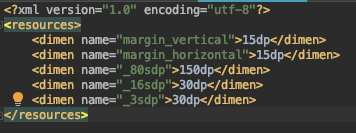

    c. **drawable**, berdasarkan properti pada `RadioButton` yang sudah dibuat di **activity_main.xml** yaitu `android:background="@drawable/radio_flat_selector"` dan `android:textColor="@drawable/radio_flat_text_selector"`, maka di direktori drawable perlu penambahan berkas sumber daya bernama **radio_flat_selector.xml** yang berfungsi memberikan efek ganti warna pada `RadioButton` ketika dipilih (berwarna pink) atau tidak dipilih (warna putih) dan **radio_flat_text_selector.xml** yang berfungsi untuk memberikan warna yang khas ketika terpilih (teks berwarna putih) dan tidak terpilih (teks berwarna pink) bagi setiap teks di `RadioButton` tersebut.

    **radio_flat_selector.xml**
    

    Perlu diketahui bahwa di dalam **radio_flat_selector.xml** ternyata membutuhkan **radio_flat_selected.xml** sebagai penanda perubahan warna untuk `RadioButton` yang terpilih dan **radio_flat_regular.xml** sebagai penanda perubahan warna untuk `RadioButton` yang tidak terpilih di direktori **drawable**, oleh karena itu tambahkan dua berkas tersebut.

    **radio_flat_selected.xml**
    

    **radio_flat_regular.xml**
    

    Perhatikan tag `<shape>` di kedua berkas radio flat, terdapat `android:shape="rectangle"` yang menandakan `RadioButton` yang dibuat berbentuk persegi (mirip `Button`, bukan bulatan point seperti `RadioButton` pada umumnya). Jika `@color/colorWhite` belum terdaftar di **colors.xml** di **values** maka tambahkan `<color name="colorWhite">#FFFFFF</color>` di dalamnya

    Adapun isi dari **radio_flat_text_selector.xml** adalah sebagai berikut:

    **radio_flat_text_selector.xml**

    

    
## Fitur BMI
Fungsi yang dikembangkan dibuat di **MainActivity.java** meliputi: fungsi dasar, fungsi hitung BMI, dan tampilan hasil melalui Dialog Box. 
### Fungsi Dasar
1. Berdasarkan kegiatan sebelumnya, diketahui terdapat tiga komponen antarmuka untuk masukan yang dibuat, yaitu: `EditText`, `RadioGroup`, dan `RadioButton`. Walaupun terdapat beberapa `Button` yang memiliki id yaitu `calc`, `krgBerat`, `tmbBerat`, `krgTinggi`, `tmbTinggi`, `krgUmur`, dan  `tmbUmur` untuk memproses nilai masukan, `Button` tersebut tidak perlu diinisialisasikan di **MainActivity.java** karena sudah didaftarkan `android:onClick=""` di `Button` tersebut (secara otomatis mengarah ke method yang dituju). 

    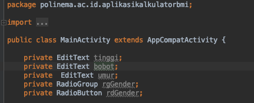

2. Tambahkan inisialisasi tipe data dari setiap `EditText` yang ditampilkan di antarmuka.

    

3. Kenalkan komponen tersebut sesuai id yang didaftarkan melalui activity_main.xml.

    

    Khusus `RadioGroup` pastikan juga diberikan sebuah variabel bernama `pilihGender` untuk mendapatkan id dari `RadioButton` yang dipilih.

    

4. Supaya tombol plus dan minus yang terdapat pada setiap menu bobot, tinggi, dan umur berfungsi maka buat method untuk mengaktifkan pengurangan dan penambahan nilai pada `EditText` di setiap menu.
Contoh pada menu bobot

    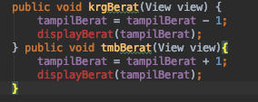

    Buat juga method yang lain untuk menu tinggi dan umur sesuai yang terdaftar di `android:onClick=""` di **activity_main.xml**. Jika `displayBerat()` masih berwarna merah, abaikan saja karena method ini dibuat di langkah selanjutnya.

5. Supaya method yang dibuat pada langkah 4 (langkah sebelumnya) berfungsi di EditText, maka tambahkan method display untuk setiap menu.

    

    Buat juga method yang lain untuk menu tinggi dan umur.

6. Versi lengkap dari langkah 4 dan 5 adalah sebagai berikut

    **method krg dan tmb**

    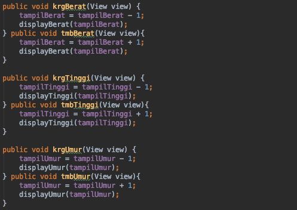

    **method display**

    

### Hitung BMI 
Penghitungan BMI membutuhkan method `calculateBMI()` sesuai dengan properti `android:onClick="calculateBMI"` pada `Button` dengan id `calc`.

1. Buat method `calculateBMI()`

    

2. Inisialisasi tipe data string untuk variabel `bobotStr` dan `tinggiStr`

    

3. Untuk menghitung BMI, pastikan kolom bobot dan tinggi tidak null (kosong)

    

4. Tambahkan penghitungan BMI

    

5. Tambahkan `displayBMI()` untuk menampilkan hasil penghitungan BMI. Jika `displayBMI()` bertanda merah, abaikan dulu karena method akan dibuat pada subbab selanjutnya.

    

### Tampil Hasil Hitung BMI
Hasil peghitungan BMI ditampilkan dalam bentuk `AlertDialog` yang diproses di method `displayBMI()`.

1. Buat method `displayBMI()`

    

2. Buat variabel dengan tipe data String bernama `bmiLabel` (untuk menampilkan hasil penghitungan BMI) dan `infoUmur` (untuk menampilkan nilai dari kolom umur yang telah dimasukkan)

    

3. Tambahkan informasi kategori BMI berdasarkan kriteria berikut.

    **Tabel Kriteria BMI**

    | Kategori             | BMI  |      |
    |----------------------|------|------|
    |                      | **dari** | **ke**   |
    | Terlalu sangat kurus |      | 15.0 |
    | Sangat kurus         | 15.0 | 16.0 |
    | Kurus                | 16   | 18.5 |
    | Normal               | 18.5 | 25   |
    | Gemuk                | 25   | 30   |
    | Cukup Gemuk          | 30   | 35   |
    | Sangat gemuk         | 35   | 40   |
    | Terlalu sangat gemuk | 40   |      |

    

4. Tambahkan `bmiLabel` sebagai variabel penampung data yang dimasukkan dan hasil penghitungan BMI.
    ```
    bmiLabel = "Jenis kelamin: " +  rdGender.getText() + "\n\n" + "Hasil     Penghitungan BMI : " + bmi + " --- " +  "Kategori: " + "(" + bmiLabel + ")" + "\n\n"     + "Umur : " + infoUmur;
    ```

5. Hasil yang ditampilkan berupa `AlertDialog`, buat `AlertDialog` dengan mengambil data dari `bmiLabel` dan jenis tombol penutupnya adalah `NeutralButton` tanpa perintah apapun di dalam `onClick`.

    ```
    AlertDialog.Builder tampilBMI = new AlertDialog.Builder(this);

        tampilBMI.setTitle("Hasil Penghitunan BMI");

        tampilBMI.setMessage(bmiLabel).setNeutralButton("Tutup", new DialogInterface.OnClickListener() {
            @Override
            public void onClick(DialogInterface dialogInterface, int i) {


            }
        });

        AlertDialog alertDialog = tampilBMI.create();
        alertDialog.show();
    ```

## Fitur Splash Screen

**SplashScreen** dibuat sebagai pengantar dari aplikasi dibuka.

### Layout splash screen

1. Buat layout baru bernama **splashbmi.xml** dengan satu komponen `TextView` (boleh ditambah komponen lain). Warna background pada modul ini menggunakan warna `#3395ff`.

    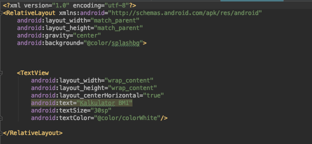

2. Hasil layout **splashbmi.xml**

    

### Fungsi splash screen

Buat **SplashActivity.java**, intent diarahkan ke **MainActivity.java** melalui `handler`, splash screen diatur selama 3.000 second.
    

### Konfigurasi Android Manifest

Karena tampilan awal dari aplikasi ini adalah splash screen, maka harus dilakukan perubahan pengaturan di **AndroidManifest.xml** dengan cara sebagai berikut:

1. Buka **AndroidManifest.xml** di **app -> manifest - AndroidManifest.xml**.
2. Ubah `<activity android:name=".MainActivity">` menjadi `<activity android:name=".SplashActivity">`.
3. Tambahkan activity baru dengan nama `.MainActivity` sehingga kode di dalam **AndroidManifest.xml** secara keseluruhan adalah sebagai berikut
    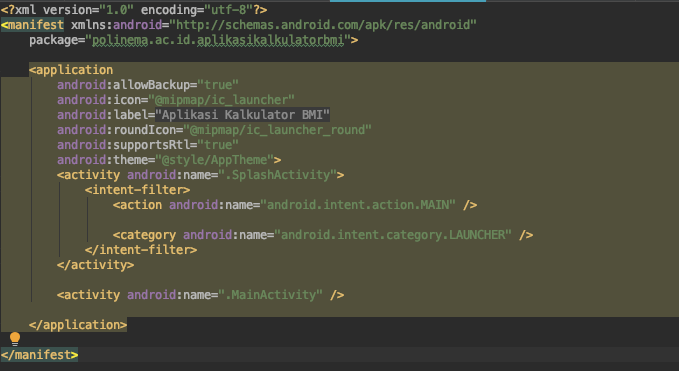

## Hasil Aplikasi

Jalankan aplikasi yang telah dibuat, jika berhasil maka aplikasi akan berjalan sesuai tahapan berikut:

1. Muncul splashscreen sebagai tampilan pembuka aplikasi
    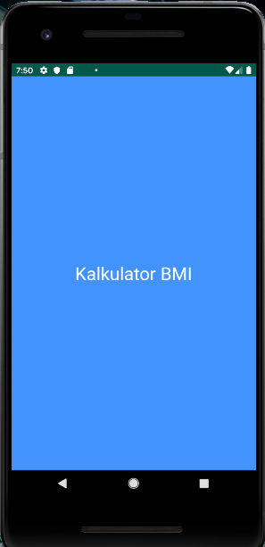

2. Tampilan berikutnya adalah tampilan kalkulator dengan set nilai pada setiap menu bobot, tinggi, dan umur adalah 0 (sesuai set saat inisialisasi di kode program)
    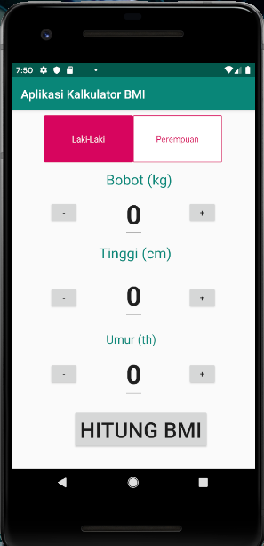

3. Percobaan pengisian data
    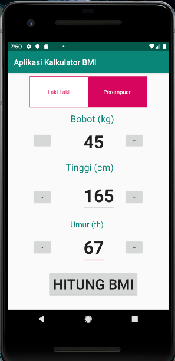

4. Tekan tombol **Hitung BMI** dan laporan hasil penghitungan ditampilkan
    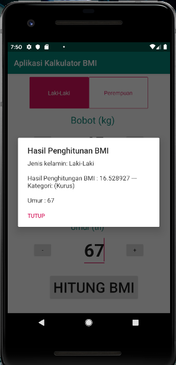
